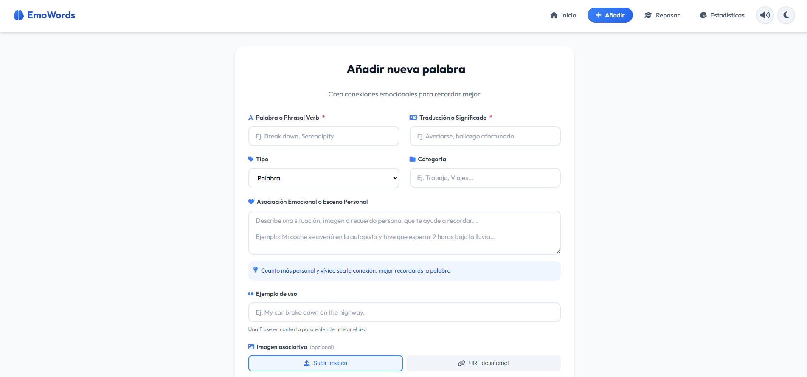

# EmoWords

**EmoWords** is a Progressive Web App (PWA) designed to help you memorize English vocabulary using emotional associations and personal memories. Science shows that emotions multiply memory retention by 10x — this app puts that science into practice.

**Live Demo:** [https://alvarobarrenadev.github.io/emowords/](https://alvarobarrenadev.github.io/emowords/)

## Philosophy

Repetition fades. Emotion sticks.

EmoWords is built on a neuroscientific principle: when you connect a word with a personal memory or an emotion, your brain stores it in long-term memory far more effectively than through mechanical repetition alone.

## Main Features

### Vocabulary Management
- Add words, phrasal verbs, connectors, and expressions
- Associate each word with an emotional memory or personal situation
- Includes translation, usage examples, and custom categories
- Support for associative images (local upload or URL)
- Search and filter by type, category, and mastery status
- Sort by date, alphabetical order, or mastery level

### Smart Review System (Spaced Repetition SM-2)
- SM-2 algorithm to optimize review intervals
- 5 different practice modes:
  - **Mixed**: Combines all modes randomly (recommended)
  - **Flashcards**: Flip cards to see the translation
  - **Quiz**: Select the correct answer from 4 options
  - **Writing**: Type the correct word
  - **Listening**: Listen to pronunciation and select the meaning
- Automatic prioritization of forgotten words
- Review sessions with result summaries

### Pronunciation & Audio
- Integrated Text-to-Speech to hear pronunciation
- Accent configuration (American or British)
- Playback speed control (slow, normal, fast)

### Gamification & Progress
- XP-based level system
- Daily study streaks
- Unlockable achievements for milestones:
  - Number of words added
  - Consecutive streak days
  - Completed review sessions
  - Mastered words
  - Levels reached
- Customizable daily goals
- Animated celebrations with confetti

### Detailed Statistics
- Visual dashboard with key metrics
- Vocabulary growth chart
- Activity heatmap
- Words that need more practice
- Future progress prediction
- Distribution by word type
- Retention rate

### Starter Packs
- Pre-defined vocabulary packs organized by CEFR level:
  - **A1/A2**: Survival vocabulary and basic conversation
  - **B1**: Expressions for fluent speaking
  - **B2**: Advanced vocabulary from movies and series
  - **C1**: Professional language and networking
  - **C2**: Idiomatic expressions and emotional nuances
- Each word includes a pre-defined emotional association
- One-click import

### Import & Export
- Export/Import data in JSON format
- CSV import support
- CSV export for use in other tools

### PWA (Progressive Web App)
- Installable as a native app on any device
- Works offline without internet connection
- Automatic data synchronization in LocalStorage

## Screenshots

### Onboarding


### Home Screen


### Add Word


### Review Mode


### Statistics


### Audio Settings


## Technologies Used

- **Frontend**: HTML5, CSS3 (Sass), JavaScript ES6+
- **Bundler**: Vite
- **Styles**: Sass/SCSS with modular architecture
- **Storage**: LocalStorage
- **Audio**: Web Speech API (Text-to-Speech)
- **Animations**: CSS Transitions + canvas-confetti
- **Alerts**: SweetAlert2
- **Icons**: Font Awesome 6
- **Typography**: Inter, Outfit (Google Fonts)
- **Testing**: Vitest + JSDOM
- **Deploy**: GitHub Pages

## Installation and Local Development

### Prerequisites
- Node.js (v18 or higher recommended)
- npm

### Installation

1. Clone the repository:
```bash
git clone https://github.com/alvarobarrenadev/emowords.git
cd emowords
```

2. Install dependencies:
```bash
npm install
```

3. Start the development server:
```bash
npm run dev
```

4. Open in your browser: [http://localhost:5173](http://localhost:5173)

### Other commands

```bash
# Run tests
npm run test

# Build for production
npm run build

# Preview production build
npm run preview

# Deploy to GitHub Pages
npm run deploy
```

## Install as App (PWA)

EmoWords is a Progressive Web App. You can install it to use it offline:

### Android / Chrome
1. Open the app in Chrome
2. Tap the menu (three dots)
3. Select "Install app" or "Add to Home screen"

### iOS (Safari)
1. Open the app in Safari
2. Tap the "Share" button (square with arrow)
3. Select "Add to Home Screen"

### Desktop (Chrome/Edge)
1. Open the app in the browser
2. Click the install icon in the address bar
3. Confirm installation

## Project Structure

```
emowords/
├── public/
│   ├── favicon/          # Icons and PWA manifest
│   ├── screenshots/      # Screenshots for README
│   └── sw.js             # Service Worker
├── src/
│   ├── js/
│   │   ├── components/   # Reusable components
│   │   ├── data/         # Pre-defined starter packs
│   │   ├── storage/      # Storage logic and gamification
│   │   ├── utils/        # Utilities (TTS, UI helpers)
│   │   ├── views/        # Main views
│   │   └── main.js       # Entry point
│   └── sass/             # Modular SCSS styles
├── index.html
├── vite.config.js
└── package.json
```

## Architecture

### Views
- **Home**: Word list, search, filters, starter packs
- **Add**: Form to add/edit words
- **Review**: Practice modes with spaced repetition system
- **Stats**: Statistics dashboard and achievements

### Storage
- `vocabStorage.js`: Word CRUD, SM-2 algorithm, import/export
- `gamification.js`: Streaks, XP, levels, daily goals
- `achievements.js`: Achievement system and unlock conditions

### Components
- `wordCard.js`: Word cards with actions
- `onboarding.js`: Interactive tutorial for new users
- `achievementNotification.js`: Notifications for achievements and level ups

## Contributing

Contributions are welcome. Please:

1. Fork the repository
2. Create a branch for your feature (`git checkout -b feature/new-feature`)
3. Commit your changes (`git commit -m 'Add new feature'`)
4. Push to the branch (`git push origin feature/new-feature`)
5. Open a Pull Request

## Author

Developed by **[Alvaro Barrena Revilla](https://github.com/alvarobarrenadev)**

Portfolio: [alvarobarrena.vercel.app](https://alvarobarrena.vercel.app)