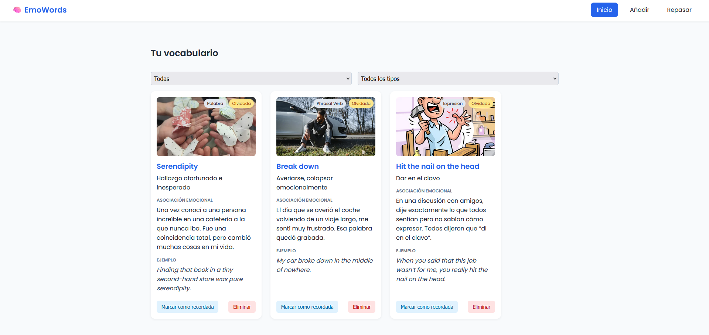
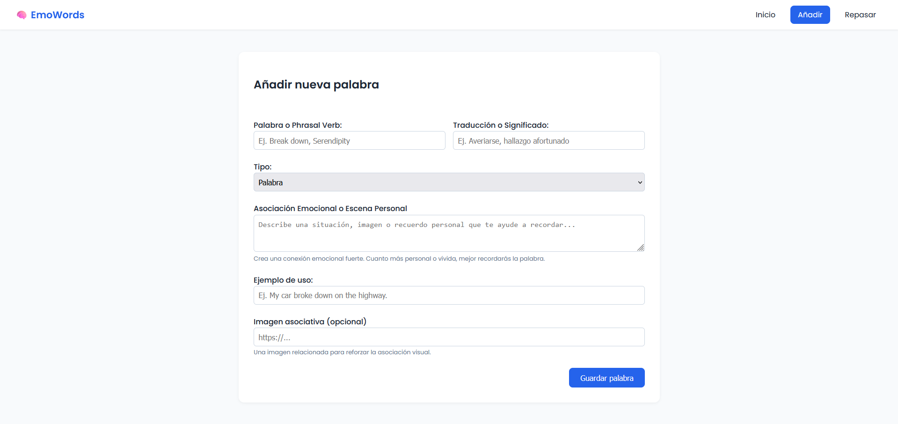
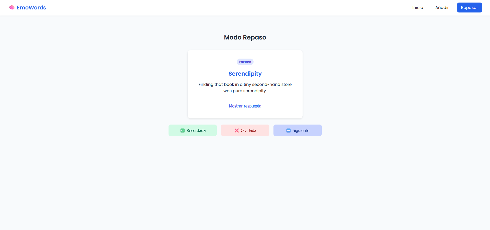

# EmoWords 🧠

**EmoWords** es una aplicación web minimalista para ayudarte a memorizar vocabulario en inglés usando asociaciones emocionales, imágenes y repaso activo. Diseñada para estudiantes de idiomas que quieren recordar palabras con sentido.

---

## ✨ Funcionalidades

- 📚 Añade palabras, phrasal verbs o expresiones.
- 💭 Asocia recuerdos personales o emociones para reforzar la memoria.
- 🖼️ Añade imágenes asociativas (por URL o carga local).
- 🔁 Modo repaso tipo flashcard con priorización de palabras olvidadas.
- ✅ Marca palabras como recordadas u olvidadas.
- 🔍 Filtros por tipo y estado.
- 📱 **Instalable (PWA):** Funciona offline y se puede instalar como una app nativa.

---

## 📱 Cómo instalar como App (PWA)

**EmoWords** es una Progressive Web App. Puedes instalarla para usarla sin conexión:

### Android / Chrome
1. Pulsa el botón **"Instalar"** en la barra de navegación superior.
2. O en el menú del navegador: "Instalar aplicación".

### iOS (Safari)
1. Pulsa el botón **Compartir** (cuadrado con flecha).
2. Selecciona **"Añadir a pantalla de inicio"**.

### Escritorio
1. Pulsa el icono de instalación en la barra de direcciones del navegador.

---

## 📸 Capturas

### Vista principal


### Añadir palabra


### Modo repaso


---

## 🛠️ Tecnologías usadas

- HTML5 + CSS3
- JavaScript (Vanilla)
- Vite
- LocalStorage

---

## 🚀 Cómo ejecutar en local

1. Clona el repositorio:

```bash
git clone https://github.com/alvarobarrenadev/emowords.git
cd emowords
```

2. Instala dependencias:

```bash
npm install
```

3. Inicia el entorno de desarrollo:

```bash
npm run dev
```

4. Abre en tu navegador: [http://localhost:5173](http://localhost:5173)

---

## 🧠 Motivación

Este proyecto nació de la necesidad real de memorizar palabras en inglés no solo por repetición, sino conectándolas con algo significativo. La emoción graba, la repetición se olvida.

---

## ✍️ Autor

Desarrollado por **[Álvaro Barrena Revilla](https://github.com/alvarobarrenadev)**.